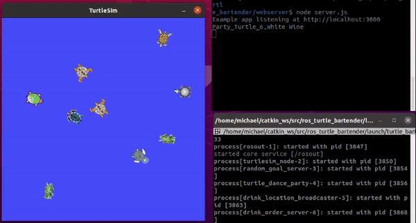
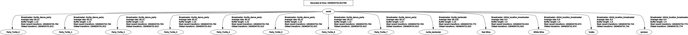
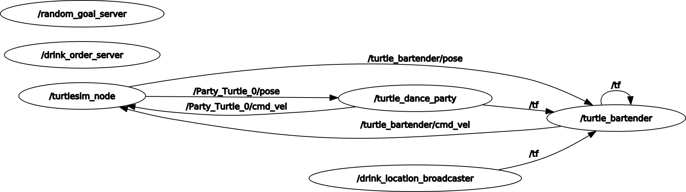

# Turtle bartender app in ROS #

This repository hosts the source code for the ROS < ros_turtle_bartender > package which setups a turtle party and a bartender who takes drink orders from a webserver and delivers drinks to turtle customers and contributing to their good time.

I created this game to practice using the ROS TF2 funcitionality.  The tf2 maintains the relationship between coordinate frames in a tree structure buffered in time, and allowed the bartender to find where the `drink stands` are located to pick up the correct drink and where the `customers` where located to deliver the drinks.

## Key concepts covered ##
- The goal of this app is to practice the TF funcitionality of ROS.
- As part of the app I wanted the work to be distributed from a webserver to simulate how a robot in the wild might be assigned tasks.
- The app will be to spawn a number of customers who are moving around randomly in a turtlesim space.
- One turtle will be a bartender who gets a drink order from a web server and must deliver to a specific turtle customer
- There are 4 drink options: Red Wine, White Wine, Vodka and Jamison.  Depending on which drink the bartender will need to move to a designated corner of the screen to pick up the drink then deliver the drink to the customer to simulate an automated drink stand.
- The TF broadcasting functionality will be used to for the bartender to find the way to the customer who is actually always moving (or dancing) in the area
- Once the drink is delivered the turtle bartender will ask the webserver for the next drink order
- The webserver will simply randomly choose the drink and customer to deliver.

Here is rqt graph of the tf frames being broadcast.

Here on YouTube I quickly go through running the game and the code.

## Usage ## 

To use the `ros_turtle_bartender` package clone this repository into the `src` folder of your catkin workspace.

Then build the workspace with `catkin_make`.

In the `ros_turtle_bartender` directory using the `terminal` enter the `webserver` directory.

Using the terminal when inside the `~/webserver` directory run `npm install` command to grab all of the node_modules required.  

If you do not have nodjs installed you can do so by using the command:

`- # Using Ubuntu
- curl -sL https://deb.nodesource.com/setup_15.x | sudo -E bash -
- sudo apt-get install -y nodejs`

To start the webserver in the terminal use the command: `npm start` 

Finally start the package using roslaunch command: `roslaunch ros_turtle_bartender turtle_bartender.launch`

## Node descriptions ##

Below is a picture of the rqt_graph outlining the nodes and the topics they use for communication.  Here is a brief description of each node moving from left to right in the rqt_graph.

### /random_goal_server ###
- This node is a service server giving the Party Turtles some random dance moves or goals to move to

### /drink_order_server ###
- This node is a service server connecting to the webserver to get the next customer and drink order for the turtle bartender to fullfill

### /turtlesim_node ###
- this is the main node for the turtlesim robot.

### /turtle_dance_party ###
- This node sets up all the Party turtles and moves them around the party using the /random_goal_server.  It broadcasts to the TF the position of each turtle by name.

### /drink_location_broadcaster ###
- This node broadcasts the position of the drink stands.

### /turtle_bartender ###
- This node is the bartender control.  When a new order is received from the drink_order_server the bartender moves to the location of the drink broad cast in the TF and then the Party Turtle at the location broadcast in the TF.  When completed it requests a new order.
