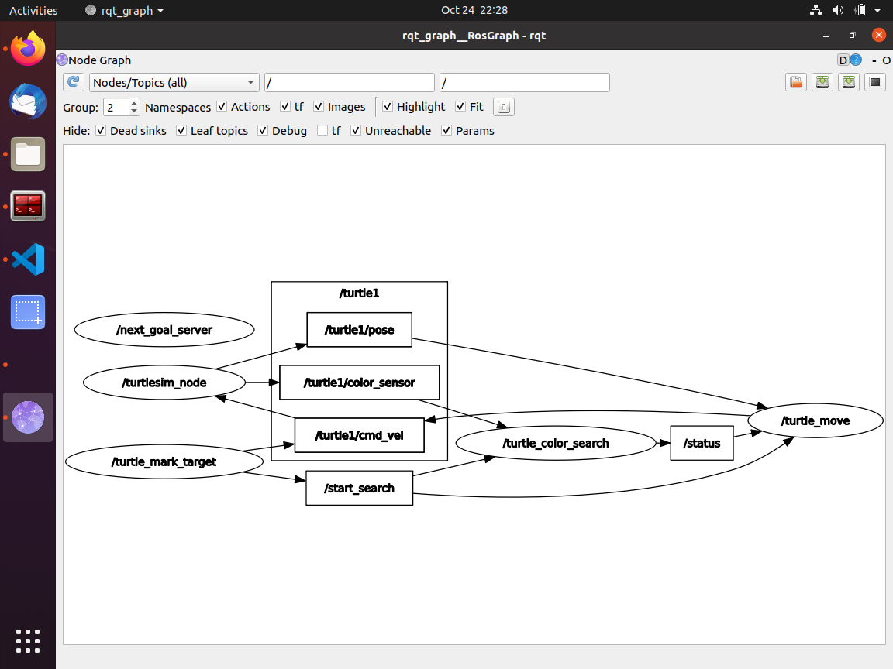
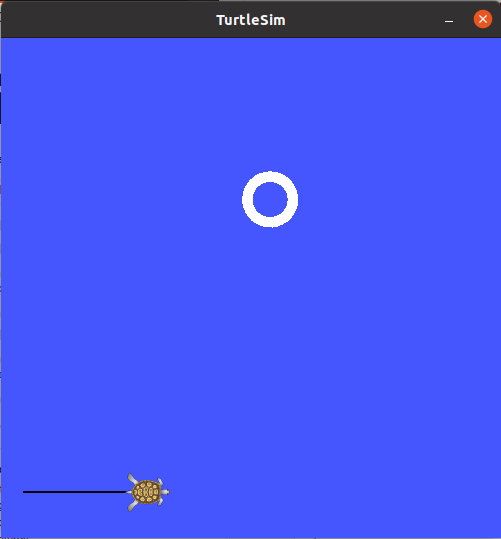
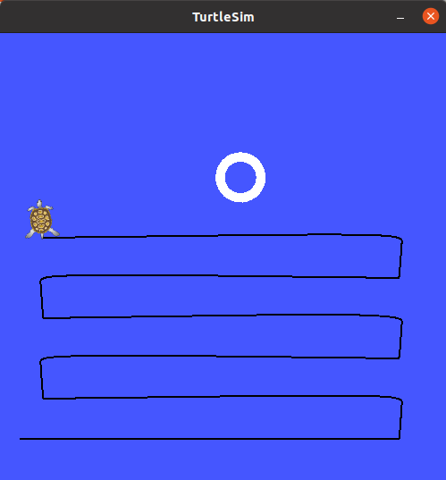
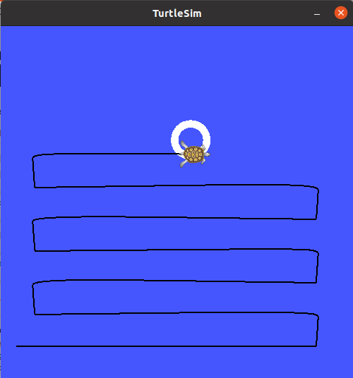

# Hide and seek game in ROS #

I created this game to practice with some of the beginner ROS concepts.  

The game will have the turtlesim robot search for a ball in it's workspace.  The starting parameters and search density be start parameters from the roslaunch file to place a ball at a x, y location and the search step size.  

Then turtlesim then will perform a search of the area in a zig-zag pattern with a specified search step size until it finds the ball using the color sensor.

Here on YouTube I quickly go through running the game and the code.

## Key concepts covered ##
- setting rosparam from roslaunch file: input for x, y and the search step size
- roslaunch of multiple nodes and ensuring they all start properly and are activated as setup continues (needed to create topics which advertised when the setup was complete)
- how to control the turtlesim robot to place the ball
- Subscribing to pose, color sensor topics to control the turtlesim robot and look for the ball
- Creating custom topics to communicate with nodes control data
- building a custom next goal service which calculates the next goal to the turtlesim robot.  The search routine will be simply a zig-zag pattern with a spacing specified in the roslaunch file, search will always start at a search step distance from 0,0 
- implementing go-to-goal algorithm and ensure driving is smooth

## Node descriptions ##

Below is a picture of the rqt_graph outlining the nodes and the topics they use for communication.  Here is a brief description of each node moving from left to right in the rqt_graph.

### /next_goal_server ###
- this node is the server for the NextGoal service which calculates the next goal for the turtlesim robot to drive towards as it searches for the ball.  When the next goal is outside of the turtlesim environment it sends a complete message to stop the game.

### /turtlesim_node ###
- this is the main node for the turtlesim robot.

### /turtle_mark_target ###
- this node setups the playing field by drawing a circle at the x,y location specified in the roslaunch file.  When the setup is complete it publishes on the /start_search topic the search can begin.

### /turtle_color_search ###
- this node subscribes to the /turtle1/color_sensor topic and looks for the r,g,b values to be above 200 signalling it has found the ball.  When the ball is found it will publish a message on the /status topic to signal the search is complete.

### /turtle_move ###
- this node is what gives velocity commands to move the turtlesim robot.  When it reachs a goal it will request the next goal from the next_goal_server until it receives a complete from the server or a complete from the /turtule_color_search.

